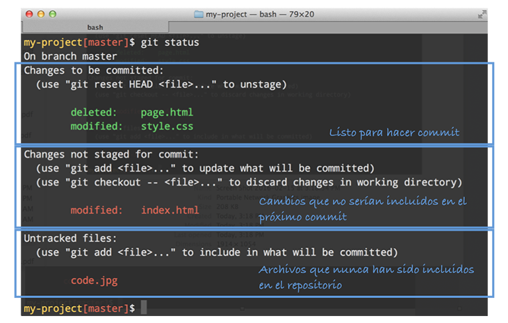

# Conceptos y comandos esenciales

El primer paso para trabajar con git es inicializar el **repositorio**. Un **repositorio** no es más que una carpeta oculta llamada `.git` que va a estar en la raíz del proyecto y que va a contener todo el historial de cambios.

Para inicializar un **repositorio** ingresa a la carpeta del proyecto y ejecuta el siguiente comando:

```
git init
```

Este comando crea la carpeta oculta `.git` con algunos archivos y carpetas; sólo se debe ejecutar una única vez por proyecto.

A los archivos y carpetas del proyecto (todo lo que esté por fuera de la carpeta `.git`) se les llama el **espacio de trabajo**.

## Commits

Una vez que el repositorio ha sido inicializado puedes empezar a crear **commits**. Un **commit** es una fotografía de tu proyecto en un momento determinado.

Para crear un commit ejecuta los siguientes dos comandos:

```
git add .
git commit -m 'Acá va el mensaje describiendo los cambios'
```

El primer comando, `git add .`, le dice a **git** que incluya todos los cambios en el siguiente **commit**. Un cambio puede ser: un archivo nuevo, un archivo modificado, un archivo eliminado o un archivo movido a otra ubicación. Más adelante veremos cómo seleccionar individualmente los cambios que queremos incluir en el siguiente **commit**.

El segundo comando, `git commit` es el que crea el commit. Cada **commit** tiene la siguiente información:

* Un identificador (una cadena larga de caracteres)
* Un autor (nombre y correo electrónico)
* Una fecha
* Un mensaje que describe el commit (lo escribe uno cuando crea el commit)
* Los cambios desde el último commit.

También es posible escribir varias líneas en el mensaje de commit. Si omites la opción `-m` se abrirá el editor de texto por defecto para que ingreses el mensaje:

```
git commit
```

### El historial de commits

Para ver el historial de commits utiliza el comando `git log`:

```
$ git log
commit 7844a6552c2f838db7b7bed81f7be61e4b51ac84
Author: Pedro Perez <pedro@gmail.com>
Date:   Sun Jan 19 15:33:49 2020 -0500

    Modifica el landing principal

commit fc3b5612f0e23158263ad1a47d91d6c8f84f1a1f
Author: Pedro Perez <pedro@gmail.com>
Date:   Sun Jan 19 14:43:21 2020 -0500

    Crea el landing principal

commit a4fcb6a1c87958a64e305c302757b591822b7075
Author: Pedro Perez <pedro@gmail.com>
Date:   Sun Jan 19 14:23:20 2020 -0500

    Primer commit

```

Este comando muestra los **commits** en orden descendente (primero los más recientes).

Puedes utilizar la opción `--oneline` para ver una versión resumida que muestra los primeros 7 caracteres del identificador y el mensaje de cada **commit**:

```
$ git log --oneline
7844a65 Modifica el landing principal
fc3b561 Crea el landing principal
a4fcb6a Primer commit
```

Para ver un commit específico utiliza `git show` seguido del identificador del commit (puedes utilizar los primeros 7 caracteres). Este comando, además de la información del commit, muestra la lista de cambios.

```
$ git show fc3b561
commit fc3b5612f0e23158263ad1a47d91d6c8f84f1a1f
Author: Pedro Perez <pedro@gmail.com>
Date:   Sun Jan 19 14:43:21 2020 -0500

    Crea el landing principal

diff --git a/index.html b/index.html
index 1196288..fe8ec0c 100644
--- a/index.html
+++ b/index.html
@@ -1,2 +1,2 @@
 Esta línea ya estaba
+Esta línea se agregó
-Esta línea se eliminó
```

Cada cambio empieza con la línea `diff --git`. En este ejemplo sólo tenemos un cambio (el archivo `index.html`). En las últimas líneas vemos qué cambio: una línea se agregó (la que empieza con `+`) y otra se eliminó (la que empieza con `-`). Generalmente en la consola aparecen las nuevas líneas en verde y las que se eliminaron en rojo.

## El estado del repositorio

Utiliza el comando `git status` para ver el estado del **repositorio**: los nuevos archivos, archivos modificados, archivos eliminados, los cambios que se van a incluir en el próximo **commit**, etc.

Cuando el repositorio no tiene cambios vas a ver algo así:

```
$ git status
On branch master
nothing to commit, working tree clean
```

Si hay cambios, `git status` muestra tres secciones:

1. Archivos que se van a incluir en el siguiente commit (a esto se le conoce como el **index**).
2. Archivos modificados o eliminados que aún no están en el index (no serían incluídos en el siguiente commit).
3. Nuevos archivos.

La siguiente imagen muestra un ejemplo de `git status` que tiene las tres secciones:



Sin embargo, si alguna sección no tiene archivos, esa sección no se muestra al ejecutar `git status`.

Cada sección nos muestra algunos comandos que podemos utilizar para pasar los archivos de un estado a otro. Veamos las operaciones más comunes:

### Agregando un archivo al index

El **index** es el espacio que contiene los cambios que se van a incluir en el siguiente commit.

Para agregar un archivo nuevo o modificado al index utiliza el comando `git add` seguido del nombre del archivo (puedes incluir varios archivos separados por espacio). Por ejemplo:

```
git add index.html
```

Este comando agregaría el archivo `index.html` al **index** (asumiendo que el archivo es nuevo, tiene cambios o fue eliminar) y aparecería en la primera sección del `git status`.

Para agregar todos los cambios utiliza el comando:

```
git add .
```

**Sólo los archivos que estén en el index serán incluídos en el siguiente commit**.

### Removiendo un archivo del index

Si agregaste un archivo al **index** y después deseas removerlo, es decir, ya no lo quieres incluir en el siguiente commit, puedes utilizar el comando `git reset HEAD` seguido del nombre del archivo:

```
git reset HEAD index.html
```

Este comando remueve el archivo `index.html` del **index**. Los cambios no se pierden pero los cambios de ese archivo no se incluirán en el siguiente commit y el archivo aparecerá en la sección de archivos modificados del `git status`.

### Descartando cambios

Si quieres descartar los cambios de un archivo completamente, es decir, volver a como se encontraba en el último **commit**, utiliza el comando `git checkout --` seguido del nombre del archivo:

```
git checkout -- index.html
```

Para que este comando funcione, el archivo se debe encontrar fuera del **index**. Si el archivo está en el **index** debes removerlo (como se muestra en la sección anterior) antes ejecutar este comando.

### Explorando los cambios

Para ver los cambios que aún no están en el index utiliza el siguiente comando:

```
git diff
```

Para ver los cambios que están en el index utiliza:

```
git diff --staged
```

El resultado de `git diff` (con o sin la opción `--staged`) es igual a lo que vimos previamente en la sección estado del repositorio con el comando `git show`.

## Resumen de comandos

En esta sección vamos a hacer un resumen de los comandos que hemos visto hasta ahora:

* `git init` - inicializa un repositorio.
* `git add` - agrega archivos al index.
* `git commit` - crea un commit, sólo los archivos que estén en el index serán incluídos en el commit.
* `git log` - muestra el historial de commits.
* `git show` - muestra la información de un commit específico incluyendo los cambios que se realizaron en ese commit.
* `git status` - muestra el estado del repositorio.
* `git reset HEAD` - remueve uno o más archivos del index.
* `git checkout --` - descarta los cambios que se hicieron a uno o más archivos.
* `git diff` - muestra los cambios que están en los archivos modificados o en el index (con la opción `--staged`).
