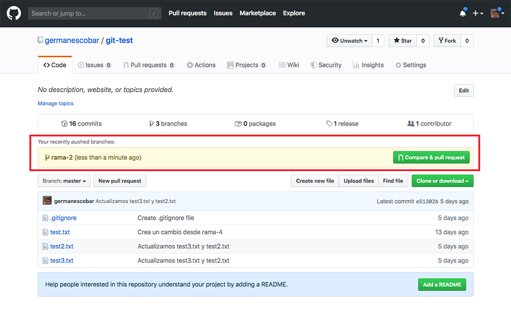
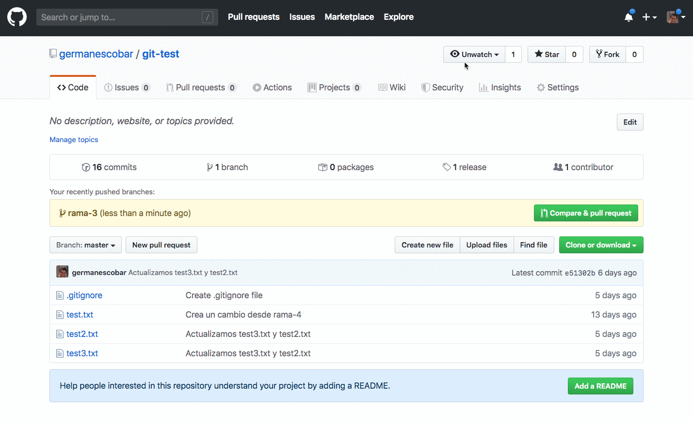

# Github

En la guía de [Repositorios remotos](repositorios-remotos.md) vimos cómo crear un repositorio en [Github](https://github.com/) y sincronizarlo con uno local. Ahora vamos a ver algunas funcionalidades adicionales de [Github](https://github.com/) para trabajar con otros colaboradores.

En [Github](https://github.com/) un repositorio puede ser público o privado. Un repositorio público es visible para cualquier persona mientras que un repositorio privado es visible únicamente para la persona (u organización) que lo creó y para los colaboradores que tengan acceso.

## El archivo `README.md`

Puedes crear un archivo llamado `README.md` en la carpeta raíz de tu proyecto y Github va a mostrar el contenido de ese archivo en la página principal del proyecto (debajo de la lista de archivos).

El archivo `README.md` se utiliza para escribir cualquier información que pueda ser útil para una persona que ve por primera vez el proyecto como la descripción, las instrucciones de instalación y de uso, una explicación de cómo contribuir, etc.

En el archivo `README.md` utiliza un formato llamado Markdown que nos permite darle estilo básico al contenido sin necesidad de escribir HTML. En [este enlace](https://guides.github.com/features/mastering-markdown/) vas a encontrar una guía de Markdown escrita por Github.

## Pull Requests

Un Pull Request (PR) es un mecanismo para solicitar, revisar y **discutir** los cambios que se van a integrar sobre una rama (generalmente `master`).

### Abriendo un Pull Request

Antes de abrir un Pull Request debemos subir una rama a un repositorio de Github. Por ejemplo, para subir una rama `bug-1` a un repositorio llamado `origin`, ejecutaríamos:

```
git push -u origin bug-1
```

Hay varias formas de abrir el Pull Request, todas se hacen desde la aplicaciónn Web de [Github](https://github.com/). Si subiste la rama recientemente y abres la página del proyecto aparecerá un mensaje para que abras el Pull Request como se muestra en la siguiente imagen (área resaltada en rojo):



De lo contrario, puedes hacer click sobre las ramas del proyecto en la parte superior de los archivos o ir a la pestaña de "Pull Requests" y abrir el Pull Request desde ahí, como se muestra en la siguiente animación:



### Comentando sobre el Pull Request

Una vez has abierto el PR, otros colaboradores pueden dejar sus comentarios generales o sobre alguna línea específica del código.

**Nota:** Si tu repositorio es público cualquier persona puede dejar un comentario sobre un PR.

También es posible iniciar una revisión, generalmente por la persona encargada de hacer la integración de la rama, pero también por otros colaboradores del proyecto.

La revisión puede terminar en un comentario, una aprobación o una petición de cambios. La siguiente animación muestra un ejemplo de una revisión:

Fata animación!

### Actualizando el Pull Request

Puedes realizar actualizaciones a tu código (p.e. un nuevo commit) y subir los cambios. El PR se actualiza automáticamente, no hay necesidad de volverlo a abrir.

Recuerda que si reescribes la historia (p.e. cambias el mensaje del último commit) debes hacer el push con la opción `-f`.

### Integrando o rechazando el Pull Request

El último paso de un PR es integrarlo a otra rama (generalmente a `master`) o rechazarlo que se puede hacer desde la página del PR.

## Issues

Los issues nos permiten hacer seguimiento de tareas, errores (bugs) y mejoras al proyecto. Para ver la lista de issues de un proyecto ingresa a la pestaña "Issues".

Un issue tiene un título, una descripción, uno o más responsables, y una o más etiquetas.

En un repositorio público cualquier persona que tenga una cuenta en Github puede ver la lista de issues, abrir un issue y comentar sobre un issue existente. En los respositorios privados sólo los colaboradores tienen acceso a los issues.

### Cerrando issues desde commits o PRs

Puedes cerrar issues desde un commit o al integrar un Pull Request utilizando alguna de las palabras claves y el número de issue que quieres cerrar. Por ejemplo, si un commit tiene en el mensaje la frase `closes #23`, automáticamente se va a cerrar el issue número 23 cuando el commit llegue a la rama por defecto (generalmente `master`).

Las palabras clave que puedes utilizar son las siguientes: close, closes, closed, fix, fixes, fixed, resolve, resolves o resolved.

## Forks

Un fork es una copia de un repositorio. Podemos hacer fork de los repositorios públicos de otras personas, y otras personas pueden realizar forks de nuestros respositorios públicos.

Las dos razones principales para hacer un fork de un repositorio de otra persona u organización son las siguientes:

1. Queremos contribuir al proyecto pero no tenemos acceso de colaborador.
2. Queremos tomar un proyecto existente como base pero realizarle algunas modificaciones propias.

Para realizar un fork ingresa a la página principal del repositorio y ubica el botón "Fork" en la parte superior derecha como se muestra en la siguiente imagen:
