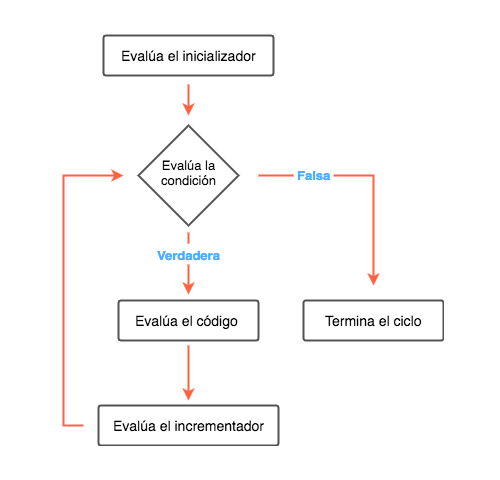

# Ciclos

Los ciclos nos permiten repetir la ejecución de un código varias veces. Imagina que quisiéramos repetir la frase "Hola mundo" 5 veces. Podríamos hacerlo manualmente. Crea un archivo llamado `loops.js` y escribe el siguiente código:

```javascript
console.log("Hola Mundo");
console.log("Hola Mundo");
console.log("Hola Mundo");
console.log("Hola Mundo");
console.log("Hola Mundo");
```

Ejecútalo y deberías ver la frase "Hola mundo" 5 veces en tu pantalla:

```text
$ node loops.js
Hola mundo
Hola mundo
Hola mundo
Hola mundo
Hola mundo
```

Ahora imagina que quisieramos repetirlo 850 veces. Ya no sería tan divertido copiar todo ese número de líneas en el archivo. Podemos entonces utilizar un ciclo. Un ciclo se crea utilizando la palabra clave `while` seguido de una condición, que va a definir el número de veces que se va a repetir ese ciclo. Reemplaza el contenido del archivo `loops.rb` por el siguiente:

```javascript
var i = 0;
while (i < 850) {
  console.log("Hola mundo");
  i = i + 1;
}
```

Ejecútalo y revisa que la frase "Hola mundo" aparezca 850 veces. Como ejercicio modifícalo para que aparezca el valor de `i` antes de cada frase. Debería salir algo así \(omitimos algunas líneas para no gastar tanto pap...ehhh...espacio en disco\):

```text
$ node loops.js
0 Hola mundo
1 Hola mundo
2 Hola mundo
...
345 Hola mundo
...
849 Hola mundo
```

Un ciclo en JavaScript tiene la siguiente sintaxis:

```javascript
while (<condicion>) {
  // acá va el cuerpo del ciclo, el código que se va a repetir mientras la condición se cumpla
}
```

La condición puede ser cualquier valor o expresión booleana. El cuerpo del ciclo se va a ejecutar mientras que la condición se cumpla. Por ejemplo, crea un archivo llamado `inifiniteLoop.js` que contenga lo siguiente:

```javascript
while (true) {
  console.log("Hola Mundo");
}
```

¿Qué crees que va a ocurrir? Antes de ejecutarlo debes saber que puedes interrumpir cualquier programa oprimiendo `Ctrl` + `C` :\)

El código anterior crea lo que en programación llamamos un **ciclo infinito**. Intenta evitarlos.

En el momento en el que la condición deja de cumplirse el ciclo se detiene y continúa con el resto del programa. Podemos crear un ciclo que nunca va a ejecutar el cuerpo del ciclo:

```javascript
while (false) {
  console.log("Hola mundo");
}
```

Si ejecutas ese código no deberías ver ninguna frase `"Hola mundo"`.

En vez de `true` o `false` puedes utilizar cualquier otra condición como lo hicimos en el ciclo que muestra `"Hola mundo"` 850 veces:

```javascript
var i = 0;
while (i < 850) {
  console.log("Hola mundo");
  i++;
}
```

Primero declaramos una variable `i` que inicia en 0. Cada vez que ingresa en el ciclo la vamos a incrementar en 1 hasta que lleguemos a 850. En ese momento la condición va a dejar de ser verdadero y el ciclo se detendrá.

## for

El `while` es todo lo que necesitas para hacer ciclos en JavaScript. Sin embargo, ese patrón que vimos en el ejemplo anterior en el que tenemos una **inicialización** \(`var i = 0`\), una **condición** \(`i < 850`\) y un **incrementador** \(`i++`\) es tan común, que JavaScript tiene un atajo para esto, el `for`.

El `for` tiene la siguiente sintaxis:

```javascript
for (<inicialización>; <condición>; <incrementador>) {
  // el cuerpo del ciclo, el código que se repite mientras que la condición sea verdadera
}
```

El ejemplo anterior lo podemos reescribir de la siguiente forma:

```javascript
for (var i = 0; i < 850; i ++) {
  console.log("Hola mundo");
}
```

Son equivalentes, la única diferencia es que el inicializador, la condición y el incrementador están definidos en la misma línea, pero se ejecuta de la misma forma que el `while`:



* La **inicialización** se ejecuta antes de evaluar la **condición** por primera vez.
* La **condición** se ejecuta cada vez que se itera.
* El **cuerpo** se ejecuta cada vez que la **condición** se cumple.
* El **incrementador** se ejecuta cada vez que el **cuerpo** se ejecuta, antes de volver a evaluar la **condición**.

**Nota:** Tanto el inicializador, la condición y el incrementador son opcionales. Si quisieras podrías hacer un ciclo infinito con un `for` de la siguiente forma:

```javascript
for(;;) {
  // el cuerpo del ciclo también es opcional
}
```

## Algunos ejemplos

Imagina que queremos hacer un programa que imprima los números del 10 a 20 pero saltando cada otro número, es decir, que imprima 10, 12, 14, 16, 18 y 20.

El primer paso antes de escribir el ciclo es identificar las diferentes partes del ciclo: la **inicialización**, la **condición**, el **incrementador** y el **cuerpo**.

Para este ejemplo serían:

1. **Inicializa** una variable en 10.
2. La **condición** es que la variable sea menor o igual a 20.
3. **Incrementa** la variable en dos en cada iteración.
4. El **cuerpo** debe imprimir la variable.

Con esta información ya puedes implementar el ciclo con `while` o `for`, recuerda que son equivalentes. La solución utilizando un `while` sería:

```javascript
var i = 10;       // el inicializador
while (i <= 20) { // la condición
  console.log(i);
  i = i + 2;      // el incrementador
}
```

Podemos hacer lo mismo con un `for`:

```javascript
for (var i=10; i <= 20; i = i + 2) {
  console.log(i);
}
```

Hagamos otro ejemplo. Imagina que queremos imprimir los números del 1 a al 100 pero deforma descendente, es decir, 100, 99, 98 ... 1. Empecemos identificando las partes del ciclo:

1. **Inicializa** una variable en 100.
2. La **condición** es que la variable sea mayor que 0.
3. El **incrementador** va a ser un decrementador en este caso, va a decrementar la variable en 1 cada iteración.
4. El **cuerpo** debe imprimir la variable.

```javascript
var i = 100;
while (i > 0) {
  console.log(i);
  i--;
}
```
