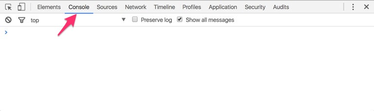
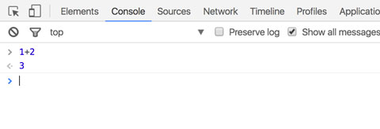

# Primeros pasos

En esta sección vas a aprender las bases de JavaScript, que te serán útiles sin importar qué camino desees tomar más adelante, ya sea convertirte en Desarrollador Front End, Backend y/o Móvil.

En este capítulo vamos a ver cómo ejecutar código JavaScript tanto en el navegador como en [Node.js](https://nodejs.org/en/), pero para la mayoría de ejemplos más adelante nos vamos a concentrar en [Node.js](https://nodejs.org/en/) únicamente. La razón es que, incluso si tu objetivo es convertirte en Desarrollador Front End, vas a necesitar [Node.js](https://nodejs.org/en/) para automatizar tareas de desarrollo y definir dependencias a librerías que utilices desde tus proyectos, así que vale la pena familiarizarse con esta plataforma desde ahora.

## Instalación de Node.js

Para seguir los ejemplos de este libro vas a necesitar instalar [Node.js](https://nodejs.org/en/). Puedes verificar si ya está instalado en tu máquina abriendo una línea de comandos y ejecutando `node -v`. Si está instalado debería aparecer una línea similar a la siguiente:

```text
$ node -v
v8.5.0
```

La versión puede ser diferente, y cualquier versión mayor a 6.0.0 está bien.

Si ves un mensaje diciendo que el comando no fue encontrado, significa que aún no lo tienes instalado. Puedes encontrar las instrucciones para instalarlo en el siguiente enlace: [https://github.com/makeitrealcamp/node-installation](https://github.com/makeitrealcamp/node-installation).

Una vez que tengas instalado [Node.js](https://nodejs.org/en/) y lo hayas verificado, continúa. En las siguientes secciones vamos a ver cómo ejecutar código JavaScript tanto en el navegador como en [Node.js](https://nodejs.org/en/).

## Ejecutando JavaScript en el navegador

Existen dos formas de ejecutar código JavaScript en los navegadores: a través de las herramientas de desarrollador que trae el navegador y creando un archivo HTML que incluya código JavaScript.

### A través de las herramientas de desarrollador

Las herramientas de desarrollador \(en inglés developer tools\) son un conjunto de herramientas integradas al navegador que utilizan los Desarrolladores Front End para analizar, depurar y mejorar su código.

La forma más fácil de abrir las herramientas de desarrollador en cualquier navegador es hacer click en cualquier parte de la página y seleccionar la opción "Inspeccionar Elemento" en el menú desplegable que aparece.

También existe un atajo del teclado para abrir y cerrar las herramientas de desarrollador. El atajo para la mayoría de navegadores en Mac es `Alt` + `Command` + `I`. Para PC es `Ctrl` + `Shift` + `I`.

Una de las herramientas que incluyen las herramientas de desarrollador es la **Consola**, que la puedes abrir haciendo click en la pestaña "Consola" \(o en Inglés "Console"\) como se muestra en la siguiente imagen.



En la **Consola** podemos escribir una expresión de JavaScript, oprimir Enter, y ver el resultado de esa expresión en la siguiente línea. Por ejemplo, escribe `1+2` y oprime Enter. Deberás ver el número `3` en la siguiente línea como se muestra en la siguiente imagen.



### A través de un documento HTML

La otra forma de ejecutar código JavaScript en el navegador es dentro de un documento HTML. Crea un archivo llamado `index.html` y pega el siguiente contenido:

```markup
<!DOCTYPE html>
<html>
  <head>
    <title>Ejemplo JavaScript</title>
  </head>
  <body>
    <script>
      alert("Hola Mundo");
    </script>
  </body>
</html>
```

Ábrelo con tu navegador preferido. Deberías ver un mensaje de alerta con el texto "Hola Mundo".

Aunque insertar el código directamente dentro del HTML funciona, se considera una mala práctica. Crea un nuevo archivo llamado `app.js` en la misma carpeta donde se encuentre `index.html` y pega el siguiente contenido:

```javascript
alert("Hola Amigo");
```

Ahora modifica `index.html` con el siguiente contenido:

```markup
<!DOCTYPE html>
<html>
  <head>
    <title>Ejemplo JavaScript</title>
  </head>
  <body>
    <script src="app.js"></script>
  </body>
</html>
```

Ábrelo nuevamente con un navegador o refresca la página si ya lo tenías abierto. Deberías ver una alerta pero ahora con el texto "Hola Amigo".

## Ejecutando código en Node.js

Existen dos formas de ejecutar código JavaScript en [Node.js](https://nodejs.org/en/): desde la consola de Node.js o desde un archivo.

### La consola de Node.js

Para abrir la consola de Node.js ejecuta el siguiente comando desde la línea de comandos:

```text
$ node
>
```

La consola de Node.js nos permite escribir una **expresión** de JavaScript, oprimir Enter, y ver el resultado de esa expresión en la siguiente línea, muy parecido a cómo lo hicimos sobre la consola del navegador en la sección pasada.

Por ejemplo, si escribimos `1+2` y oprimimos `Enter` debería mostrar `3` en la siguiente línea:

```text
$ node
> 1 + 2
3
>
```

Para salir de la consola oprime `Ctrl` + `D`.

**Nota:** En JavaScript el punto y coma \(`;`\) al final de cada expresión es opcional. Cuando estemos trabajando en la consola de Node.js los vamos a omitir. Sin embargo, cuando mostremos código que va a ir en un archivo los incluímos porque es una buena práctica.

### Desde un archivo

La otra forma de ejecutar código JavaScript en [Node.js](https://nodejs.org/en/) es crear un archivo con extensión `js` en el que escribimos nuestro código y lo ejecutamos con el comando `node`.

Crea un archivo llamado `app.js`, ábrelo con tu editor favorito y pega el siguiente contenido:

```javascript
console.log("Hola Mundo!");
```

Guárdalo y ejecuta `node app.js` sobre la línea de comandos \(asegúrate de estar ubicado sobre la carpeta donde se encuentra el archivo\). Deberías ver el texto "Hola Mundo" en la siguiente línea:

```text
$ node app.js
Hola Mundo
```

Cambia el texto por cualquier otro y vuelve a ejecutar el archivo.

¡Felicitaciones, has creado tu primer programa en JavaScript con Node.js!

## Errores

Veamos ahora qué pasa si cometemos algún error en nuestro código. Por ejemplo, borra el caracter `l` de la palabra `console` y vuelve a ejecutar el archivo. Te debería aparecer un mensaje de error similar al siguiente:

```text
/Users/germanescobar/Projects/node/app.js:1
(function (exports, require, module, __filename, __dirname) { consoe.log("Hola Mundo");
                                                              ^

ReferenceError: consoe is not defined
    at Object.<anonymous> (/Users/germanescobar/Projects/node/app.js:1:63)
    at Module._compile (module.js:571:32)
    at Object.Module._extensions..js (module.js:580:10)
    at Module.load (module.js:488:32)
    at tryModuleLoad (module.js:447:12)
    at Function.Module._load (module.js:439:3)
    at Module.runMain (module.js:605:10)
    at run (bootstrap_node.js:420:7)
    at startup (bootstrap_node.js:139:9)
    at bootstrap_node.js:535:3
```

Toma un tiempo acostumbrarse a leer los mensajes de error de Node.js pero ahí está todo lo que necesitas saber para solucionarlo. El caracter `^` nos muestra dónde ocurrió el error \(aunque está mezclado con otro código que genera Node.js\) y debajo de esa línea una frase que dice `ReferenceError: consoe is not defined`.

Hay veces en los que es fácil encontrar los errores, otras veces no es tan fácil. Lo que si es cierto es que a medida que vayas trabajando con el lenguaje vas a ir desarrollando una intuición que te va a permitir solucionar los errores más fácilmente, pero al principio es un proceso lento que es parte de ese aprendizaje.

Cometamos otro error intencionalmente para ver un mensaje diferente. Vuelve a escribir `console` correctamente, pero ahora borra la comilla al final de la cadena de texto así:

```javascript
console.log("Hola Mundo);
```

Y vuelve a ejecutar el archivo. Debería salir un mensaje como el siguiente:

```text
/Users/germanescobar/Projects/node/app.js:1
(function (exports, require, module, __filename, __dirname) { console.log("Hola Mundo);
                                                                          ^^^^^^^^^^^^^
SyntaxError: Invalid or unexpected token
    at Object.exports.runInThisContext (vm.js:78:16)
    at Module._compile (module.js:543:28)
    at Object.Module._extensions..js (module.js:580:10)
    at Module.load (module.js:488:32)
    at tryModuleLoad (module.js:447:12)
    at Function.Module._load (module.js:439:3)
    at Module.runMain (module.js:605:10)
    at run (bootstrap_node.js:420:7)
    at startup (bootstrap_node.js:139:9)
    at bootstrap_node.js:535:3
```

Esta vez el mensaje `SyntaxError: Invalid or unexpected token` no es tan claro, pero fíjate que nos indica dónde está el problema con varios caracteres `^`.

## Escribiendo más líneas

Vuelve a agregar la comilla y verifica que se ejecute normalmente.

Node.js ejecuta el archivo línea por línea, una después de la otra. Así que podemos agregar una segunda línea a nuestro archivo:

```javascript
console.log("Hola Mundo");
console.log("Esto está muy bacano");
```

El ejecutar el archivo deberías ver el siguiente resultado:

```text
$ node app.js
Hola Mundo
Esto está muy bacano
```

## Comentarios

Los comentarios se utilizan para documentar o aclarar nuestro código y son ignorados al ejecutar el archivo. En JavaScript se utilizan los caracteres `//` para crear un comentario de una línea. Por ejemplo:

```javascript
// este es un comentario de una línea
console.log("Hola Mundo");
console.log("Esto está muy bacano"); // este es otro comentario
```

También puedes crear comentarios de múltiples líneas encerrando el texto entre `/*` y `*/`. Por ejemplo:

```javascript
/*
 este es un comentario
 de varias líneas
 console.log("esto no aparece al ejecutar el archivo")
*/
console.log("Hola Mundo");
console.log("Esto está muy bacano");
```

Fíjate que la última línea del comentario es código JavaScript válido. Sin embargo, **ese código no se ejecuta porque está como comentario**.
